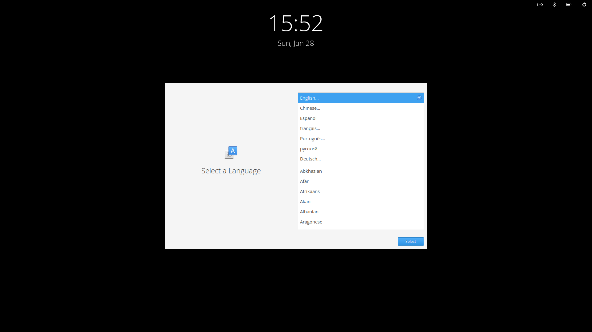
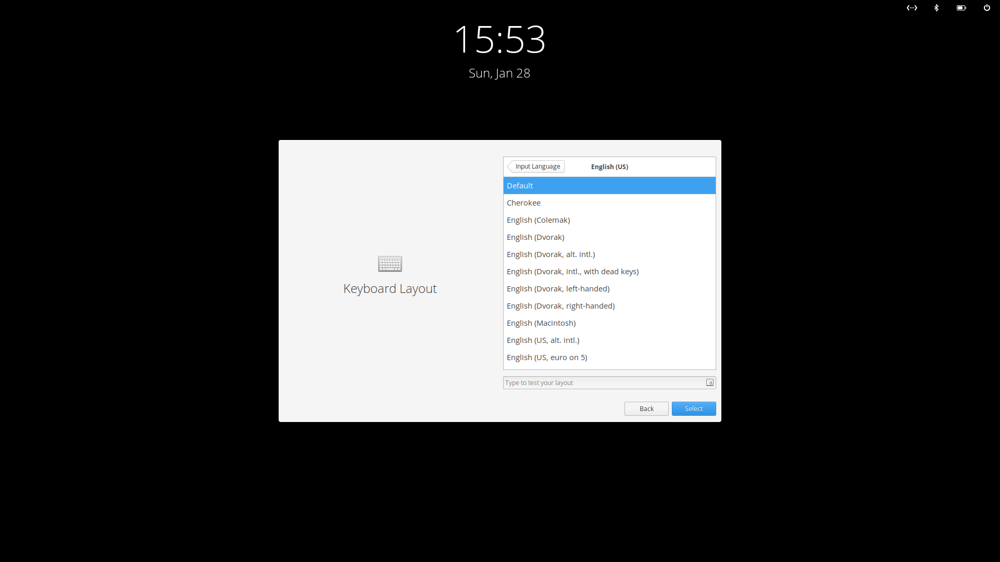
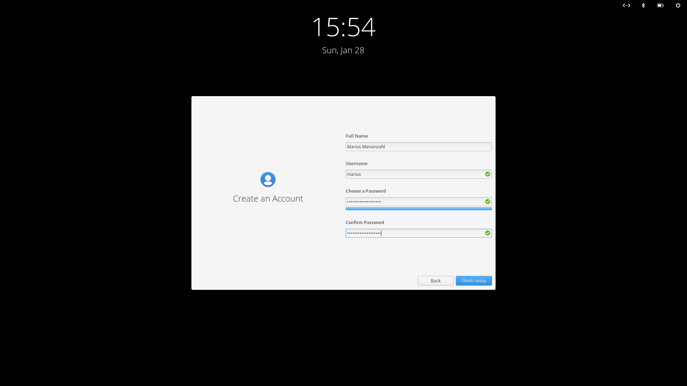
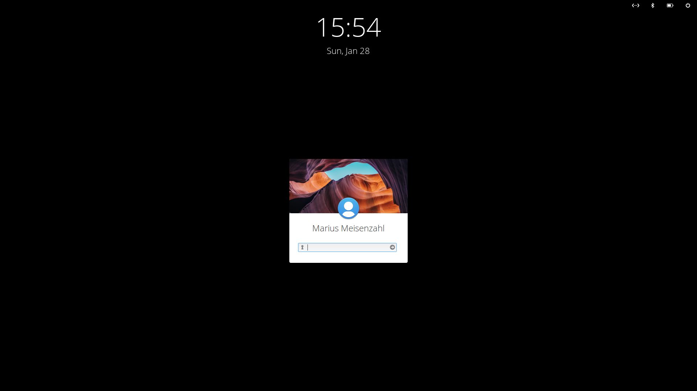
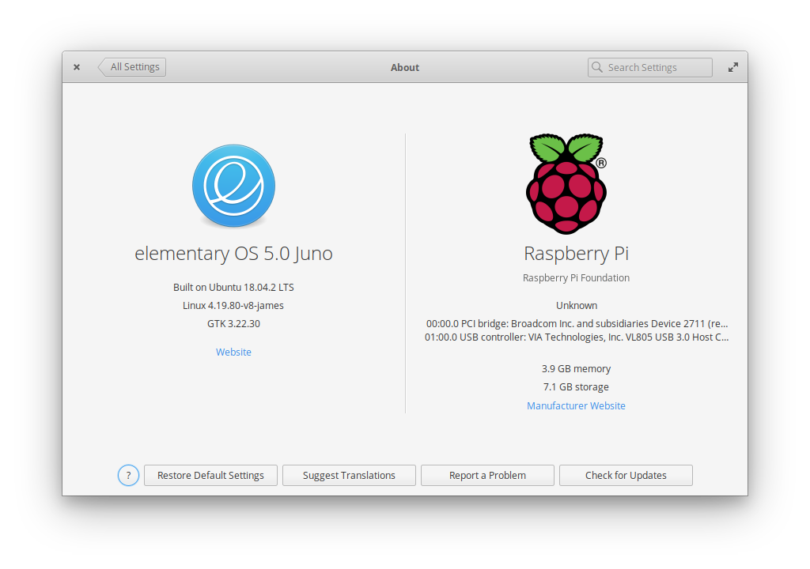
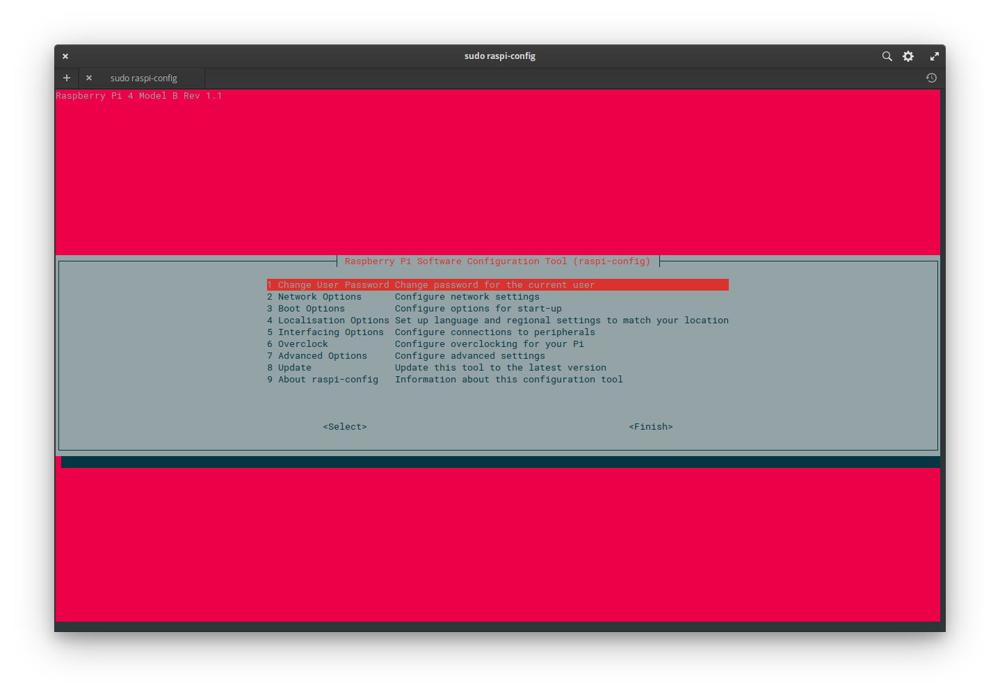
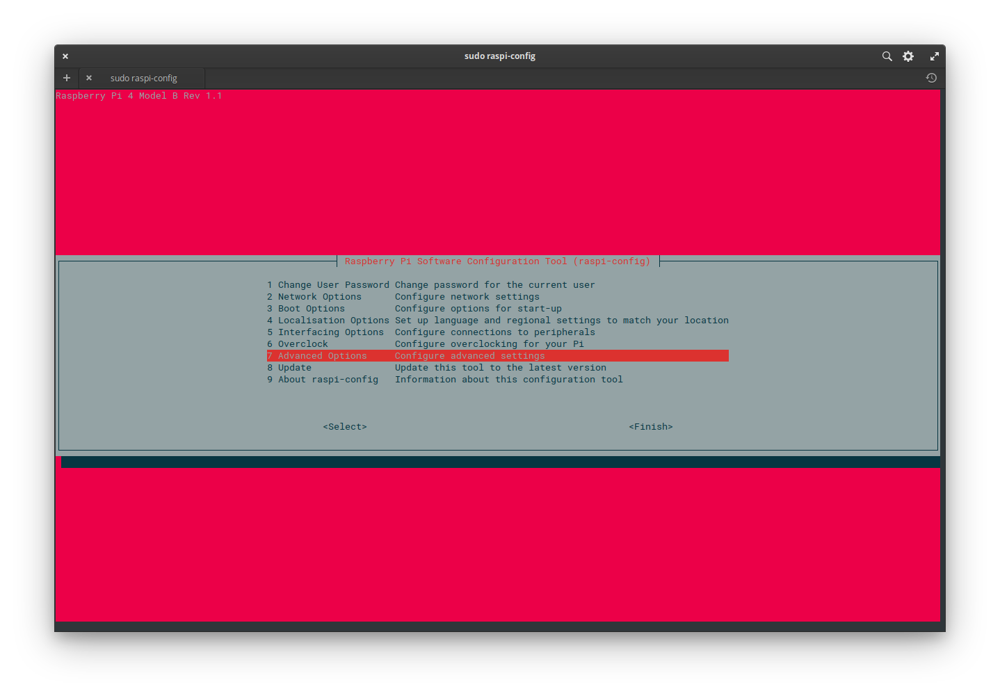
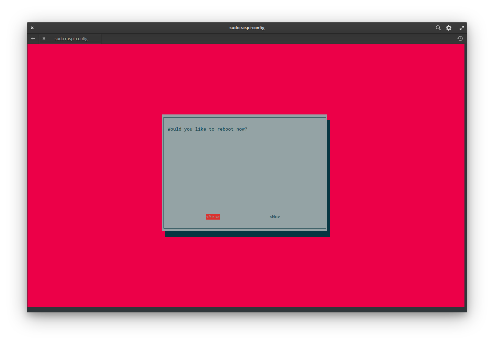

# elementary OS on Raspberry Pi 4

⚠️ **The builds are not officialy supported by the elementary project** ⚠️

To download the official version visit [https://elementary.io/](https://elementary.io/)

## Special thanks

The builds are based on the work of James A. Chambers alias [TheRemote](https://github.com/TheRemote).
He has documented his work at https://jamesachambers.com/raspberry-pi-ubuntu-server-18-04-2-installation-guide/.
He makes his builds available at https://github.com/TheRemote/Ubuntu-Server-raspi4-unofficial.

## Download

Download the latest unofficial release for Raspberry Pi 4 from https://github.com/meisenzahl/elementary-os-unofficial/releases.

## Installation

As recommended by the Raspberry Pi Foundation use [balenaEtcher](https://www.balena.io/etcher/)
to flash the image to a SD card. The SD card should be at least 8 GB in size.

After you booted your Raspberry Pi 4 you are welcomed by the new [Initial Setup](https://github.com/elementary/initial-setup) process.

First you have to choose your language.



Then you configure your keyboard layout.




Now it's time to create an account.




After you click **Finish Setup** you are welcomed by the new [Greeter](https://github.com/elementary/greeter).



When you login you get your beloved elementary OS desktop.


If you open **About** in **System Settings** you see that you are running on a Raspberry Pi.
Mine has 4 GB of RAM.



The initial size for the operating system can be increased.
`raspi-config` is available for this purpose.


For this you have to start `raspi-config` with root privileges.




Choose `7 Advanced Options - Configure advanced settings`.



Choose `A1 Expand Filesystem - Ensures that all of the SD card storage is available to the OS`.


You have to reboot to enlarge your filesystem.


So choose to reboot now.



After your Raspberry Pi 4 has booted up you can see that all storage is used.


## Support

If you come across a problem open an [issue](https://github.com/meisenzahl/elementary-os-unofficial/issues).

## Building Locally

The following example uses Docker and assumes you have Docker correctly installed and set up:

 1) Run the build:

    ```
    mkdir -p artifacts
	docker run --privileged -i \
		-v /proc:/proc \
		-v ${PWD}/artifacts:/artifacts \
		-v ${PWD}:/working_dir \
		-w /working_dir \
		debian:latest \
		./build.sh
    ```

 2) When done, your image will be in the `artifacts` folder.
